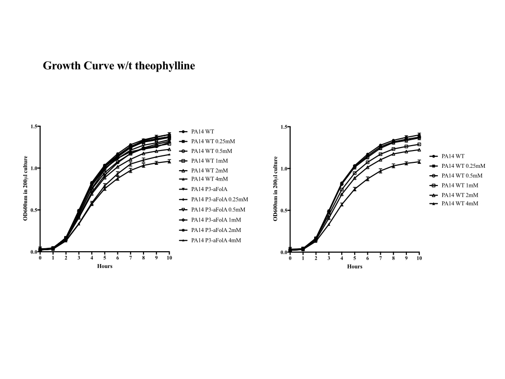

**************************************
Test ligRNAs in Pseudomonas aeruginosa
**************************************

Methods
=======

Pick target sequences
---------------------
2018/07/17:

Jiuxin provided me with a list of target sequences for the folA gene.  I used 
ViennaRNA to predict which would be most likely to not interfere with the 
ligRNA (``./predict_spacer_quality.sh``).  Notably, the folA gene is very 
GC-rich (72%), so most of the spacers had pretty high predicted affinity for the 
ligRNA insert.  The promoter region appeared to be an exception, however.  The 
4 spacers I think would be the most promising to test would be fol1, fol2, 
fol3, and fol4::

    fol1
    Spacer: UCCACGAUGAGGUAACCCCA
    Insert: GUGGGAUACCAGCCGAAAGGCCCUUGGCAGCCUAC
    ΔG:     -10.8

    fol2
    Spacer: UGGGGUUACCUCAUCGUGGA
    Insert: GUGGGAUACCAGCCGAAAGGCCCUUGGCAGCCUAC
    ΔG:     -11.1

    fol3
    Spacer: GCCAUGGGGUUACCUCAUCG
    Insert: GUGGGAUACCAGCCGAAAGGCCCUUGGCAGCCUAC
    ΔG:     -15.5

    fol4
    Spacer: UAACCCCAUGGCACGACCGC
    Insert: GUGGGAUACCAGCCGAAAGGCCCUUGGCAGCCUAC
    ΔG:     -9.5

Strain construction
-------------------
2018/07/17:

I designed sequences containing the ligRNAs with the aforementioned spacers 
that could be cloned into the Rosenberg lab's sgRNA vector using Gibson 
assembly (``./make_gibson_inserts.py``).  Jiuxin noted that my sgRNA scaffold 
is different in two positions from theirs.  This difference is intentional, and 
is due to us using different optimized scaffolds.  We decided to use my 
scaffold, as the ligRNAs may be sensitive to mutations in the scaffold.

Jiuxin constructed the strains for me, and I don't know how he did it.  To 
start with, Jiuxin only cloned the fol1 constructs.  The fol1/on construct  did 
not grow well, presumably because leaky expression of the Cas9 system inhibited 
folA too strongly.  Jiuxin had not had this problem with his previous 
constructs.  The most likely explanation for the difference is the spacer (fol1 
vs fol9), since fol1 targets the promoter region and is therefore expected to 
repress more strongly.  It's also possible that the mutations in the scaffold 
were wholly or partly responsible for the defect.  For the MIC experiments, 
we'll use Jiuxin's fol9 sgRNA as our positive control.

Minimum inhibitory concentration (MIC) of trimethoprim (TMP)
------------------------------------------------------------
Trimethoprim (TMP) is an antibiotic that targets DHFR.  CRISPRi repression of 
folA increases the sensitivity of pseudomonas to TMP.  The minimum inhibitory 
concentration (MIC) of theophylline quantifies this sensitivity.  We are 
specifically testing the theophylline affects the MIC for the ligRNA 
constructs.

For reference, here is published MIC data for P. aeruginosa [Peters2018]:

.. figure:: published_mic.svg

We are doing the experiment in two steps.  First, we are setting up a plate 
with a variety of TMP concentrations to determine the MIC for each construct.  
Second, we will measure growth curves for each of these concentrations to get 
more presentable data.

.. update:: 2018/10/12
   
   The only reason it was neccesary to do these steps separately was that the 
   Rosenberg lab didn't have a plate reader capable of incubating and 
   measuring.  The JBD lab does have such a plate reader though, so I'm now 
   doing both steps simultaneously.  See the `Growth Curves`_ section below.

1. Grow overnight cultures of each ligRNA construct (fol1/on, fol1/off, 
   fol1/rxb/11/1, fol1/mhf/30) in 3 mL LB.

2. For each culture, setup serial dilutions of TMP with and without 
   theophylline (in duplicate):

   - Measure OD600 of the culture.

   - Prepare media master mixes with and without 2x theophylline:

      - 8866.7 µL media (can't remember name or recipe)
      - 633.3 µL water (apo) or 30 mM theophylline (holo)

   - Dilute culture to OD600=0.05 in each media master mix.

   - Prepare 64 µg/mL (2x) TMP (in media).

      - I don't know the specific recipe.

   - Create 7 2x dilutions of TMP:

      - Put 4 mL 2x TMP in a tube.
      - Put 2 mL media in 6 other tubes.
      - Perform a serial dilution, transferring 2 mL on each step.

   - Pipet 100 µL of the 2x TMP dilution to the appropriate wells of a clear 
     round-bottom 96-well plate.

   - Pipet 100 µL of the culture (with or without 2x theophylline) into the 
     appropriate wells of the same plate.

- Incubate at 37°C for 15h with shaking at 350 rpm.

- Measure OD600 for each well.

It seems that both rxb/11/1 and mhf/30 affect the MIC of TMP in a 
theophylline-dependent manner.

rxb/11/1: Difference is subtle, affected by normalization of data.  

The controls are really fucked:

- on appears to have the worst repression of everything.  This may be 
  attributable to using the different spacer.

- off seems to be more repressing that mhf/30.

.. figure:: data/20180913_pseudomonas_endpoint_mic.svg 
   
.. figure:: data/20180913_pseudomonas_endpoint_mic_wells.svg 

Growth curves
-------------

Below is the basic protocol I used to setup the MIC assays.  Deviations from 
this protocol are explained for each data set below:

.. literalinclude:: 20181012_tmp_mic_assay.txt

2018/09/25:

In this experiment, I used 0.5 mM theo (rather than 1 mM) in an attempt to be 
really conscientious about avoiding theophylline toxicity.  Despite this, the 
positive control cultures with 8.0 µg/mL TMP or higher still (sometimes) seem 
to be affected by theophylline.  The effect is inconsistent, though:

- 8 µg/mL: The effect is slight, but theophylline is somewhat toxic.
- 16 µg/mL: The effect is inverted: the cultures grow faster in the presence of 
  theophylline, which doesn't make sense.  I'm inclined to attribute this to 
  the cells just taking a long time to enter log phase, and that transition 
  being somewhat stochastic.
- 32 µg/mL: The effect is just visible, because the apo cultures start growing 
  just at 24h.

The effect of theophylline on the ligRNAs is also slight and inconsistent:

- rxb/11/1, 16 µg/mL: Noticeable effect, but in the opposite direction as 
  expected.  It's noteworthy that the controls also appear to flipped for this 
  well, making me suspicious that I flipped the apo and holo conditions 
  somehow.  I double-checked my analysis scripts, and they seem to be right.  
  It's possible that I pipetted the wells wrong, but that would mean I made a 
  mistake and compensated for it, and I definitely don't remember doing that.

- rxb/11/1, 32 µg/mL: A fairly strong effect, with the caveat that the cells in 
  both conditions are clearly sick, and the previous TMP concentration showed 
  the exact opposite effect.

- mhf/30, 16 µg/mL: A very weak effect, and it's weird that the ligRNA traces 
  are outside the bounds established by the controls.  Again, I would probably 
  attribute this to sick cells and some stochasticity in when cells enter log 
  phase, but it's not encouraging.

- mhf/30, 32 µg/mL: A larger effect, but still outside the bounds of the 
  controls.  Note also that the effect of the ligRNA in this case is the same 
  as the assumed toxicity of adding theophylline.

.. figure:: data/20180925_pseudomonas_tmp_titration.svg

   Solid lines represent 0.5 mM theophylline (rather than the usual 1 mM).  
   Grey lines represent the controls, navy lines represent rxb/11/1, and teal 
   lines represent mhf/30.

2018/10/10:

In this experiment, I made an effort to better follow the canonical MIC assay 
described by [Weigand2008]_.  In particular, this meant:

a. Diluting the cells to OD=0.0025 rather than OD=0.05.
b. Starting cultures directly from plates, and from a lawn, rather than making 
   overnight cultures for single colonies and doing a 2h out-growth step.
c. Not shaking the plate during the incubation.

I deviated from the Weigand2008_ protocol in putting 50 µL mineral oil on top 
of each well.  Weigand2008_ calls for incubating the plate in a box with a wet 
paper towel to prevent evaporation, but isn't practical in the plate reader 
(Weigand2008_ also calls for just measuring OD once, by eye, after 24h, but I 
want growth curves.)  So I decided that it'd be better to have oil preventing 
evaporation, even though the oil also reduces oxygenation.

These results don't make any sense:

- The plate reader stopped recording data after ~13h.  I don't know why.

- TMP inhibits growth, but there's no difference between the controls or any of 
  the ligRNAs.

- For low concentration of TMP, growth is much slower than in the previous 
  experiment.

I think these weird results are related to (b) and (c) above, so I'm going to 
go back to my old protocol in those regards.  I'm going to keep (a) because I 
saw more growth than Peters2018_ in my previous experiment, and a larger 
innoculum could explain that.

.. figure:: data/20181010_pseudomonas_mic_1mM_theo.svg

2018/10/18:

In this experiment, I made the following changes to the protocol:

- I more finely sampled a more narrow range of TMP concentrations (4–32 µg/mL).  
- I reverted back to growing 2h starter cultures and shaking the plate during 
  incubation.
- I used the 0mM, 0.5mM, and 1mM theophylline (instead of 0mM, 1mM, and 2mM) 
  because I was worried that the ligand toxicity was too great.

When starting the day cultures, I noticed that the rxb/11/1 overnight was 
significantly more green than the other cultures.  I don't know if this has any 
significance.

Results:

- The effect of increasing TMP seems a little different for the on and off 
  controls.  The on controls spends more and more time in lag phase, but grows 
  at roughly the same rate no matter what.  Also note that sometimes just one 
  or two of the three cultures with different theophylline concentrations grow, 
  and it's inconsistent which ones.

  The off control seems to gradually grow more and more slowly, but with a 
  constant lag time (except for at 32 µg/mL TMP).  The off control is also more 
  consistent between the theophylline concentrations, but this could just be a 
  fluke.

- rxb/11/1 exhibits a slight effect in the correct direction at 11.3 and 16.0  
  µg/mL TMP.  At lower concentrations there's no effect, and at higher 
  concentrations the effect is in the wrong direction.  At 11.3 µg/mL the 
  effect is only visible for 1 mM theophylline, while at 16.0 µg/mL the effect 
  is only visible for 0.5 mM theophylline and 1 mM actually causes toxicity.

- mhf/30 exhibits a slight effect at 22.6 µg/mL TMP, but the effect is smaller 
  than the spread in the off control (although the off control is in the 
  opposite direction).  It's also odd that the mhf/30 cultures all grow better 
  than the off control, I can't think of any way to justify that.

  The effect for mhf/30 actually pretty strong at 32.0 µg/mL TMP, but at this 
  point it's even more suspicious how much better than the off control mhf/30 
  grows.

Perhaps I could convince myself that these effects are real if I manage to 
reproduce them enough times.

.. figure:: data/20181018_pseudomonas_mic_tmp_theo.svg

   The solid, dashed, and dotted lines represent 1 mM, 0.5 mM, and 0 mM 
   theophyline, respectively.

2018/10/19:

In this experiment, I doubled the concentrations of TMP relative to the 10/18 
experiment, in an effort to get to a concentration of TMP that completely 
prevents growth of even the off control.

Results:

- rxb/11/1: The slight effect visible at 11.3 and 16.0 µg/mL on 10/18 was not 
  visible this time.

- mhf/30: The effects at 22.6 and 32 µg/mL look very similar to 10/18, which is 
  encouraging.  The effect at 45.3 µg/mL looks even stronger, but in that case 
  the same effect is present in the controls, meaning that it's due to 
  theophylline toxicity rather than the ligRNA.

.. figure:: data/20181019_pseudomonas_mic_tmp_theo.svg

   The solid, dashed, and dotted lines represent 1 mM, 0.5 mM, and 0 mM 
   theophyline, respectively.

2018/10/23:

This experiment was the same as the 10/19 experiment.

Results:

- The controls are less consistent in this experiment than they have been in 
  previous experiments.  For example, [TMP]=32µg/mL mhf/30.

- mhf/30: The effects at 22.6 and 32.0 µg/mL look similar to 10/18 and 10/19, 
  which is encouraging again.  The effect is flipped at 45.3 µg/mL though, 
  which does call the robustness of these results into question.

- rxb/11/1: I noticed that I see a very slight effect at 11.3 µg/mL in all 
  three experiments.  In this experiment, there is a fairly strong effect in 
  the right direction for 0.5 mM theophylline with 22.6 and 32 µg/mL TMP.  But 
  the large spread in controls, and the complete opposite effect in the 10/18 
  and 10/19 experiments, makes me think this is just noise.

.. figure:: data/20181023_pseudomonas_mic_tmp_theo.svg

   The colored lines are 1 mM theophylline, the colored dotted/dashed lines are 
   0.5mM theophylline, and the black dashed lines are 0 mM theophylline.

2018/11/08:

In this experiment, I used 32 µg/mL TMP instead of titrating the antibiotic.  
Previously I had been hesitant about using only a single concentration of TMP,  
because the theophylline dependent effect seemed very sensitive to the 
concentration of TMP and I didn't want to miss it.  However, after several 
experiments, the effect seemed robustly reproducible at 32 µg/mL, and I wanted 
to fit more replicates on the plate.

On Tanja's advice, I interleaved the +/- theophylline and +/- TMP wells.  This 
was to better account for differences in growth due to position on the plate.

My negative control is now a strain of pseudomonas without Cas9 or an sgRNA 
instead of my usual "off" control (e.g. a misfolded sgRNA).  The "off" control 
consistently grew worse than mhf/30 apo, suggesting that it must retain some 
residual activity (not detected in any of my other assays).  I thought that a 
"wildtype" strain without Cas9 might do a better job establishing the dynamic 
range.

.. figure:: data/20181108_pseudomonas_mic_8x.svg

   Ignore the ligRNA- panel.  It's hard-coded into the analysis script, but 
   there's no data for it in this experiment.  (If there were, it would be navy 
   and black-dotted lines.)

Results:

- The theophylline-dependent effect is strong and consistent across multiple 
  technical replicates.

- The effect is not just due to theophylline toxicity, because neither of the 
  controls (grown with the same concentration of TMP) exhibit any 
  theophylline-dependent change in growth. 

- I want to try to smooth out the noise in the early part of the plots.  The 
  plate reader itself shows graphs that don't have that noise, so I feel 
  justified trying to get rid of it.

- I didn't interleave the wells correctly.  See 
  `20181108_pseudomonas_tmp_8x.toml` for details, but basically by trying to 
  simultaneously interleave theophylline and TMP, I ended up not really 
  interleaving theophylline.  I don't think it really matters, though.

.. update:: 2018/11/11
   Just to make sure there was nothing wrong with my analysis scripts, I 
   checked that the noise was actually present in the raw exported data.  It 
   was, and it's pretty easy to tell when a data point doesn't fit with its 
   neighbors.

2018/11/11:

I repeated the 11/08 experiment to (i) see if the noise goes away on its own, 
and (ii) to properly interleave the apo and holo wells.  I also included 
rxb/11/1 on Tanja's request, even though I'll be surprised if it yields any 
usable data.

.. figure:: data/20181110_pseudomonas_mic_6x.svg

Results:

- This is not enough data to say for sure, but it does kinda look like if I 
  were to run enough replicates of rxb/11/1, I might see a statistical trend in 
  the correct direction.  But I'd probably need to run a whole plate of just 
  rxb/11/1 to get enough replicates, and the results wouldn't be worht 
  publishing anyways.

- The mhf/30 traces look the same as before (which is good).

- The noise didn't go away, so I think I just need to handle it in the data 
  analysis.

2018/11/24:

I grew PA14 with 4 different titrations of TMP, corresponding to the 
experiments from 9/25, 10/18, 10/19, and 10/23.  PA14 is my negative control 
that actually works, unlike off, and so I need this data to establish the 
dynamic range of the assay, which I'm hoping to include in the manuscript.

Results
=======
Pseudomonas is relatively tolerant to theophylline.  A growth defect is 
apparent at 4 mM, and a smaller defect is present at 2 mM and 1 mM.  Below 
that, no defect is detectable.

   I'm not sure what the difference between the left and right plots are.  I 
   also don't know what P3-aFolA means.  Maybe it means the strain has Cas9 and 
   an anti-folA sgrNA.  The indicated concentrations (in mM) refer to 
   theophylline.

The strain with mhf/30 is clearly more sensitive to TMP in the presence of 
theophylline, as expected.  I worry that theophylline itself might be toxic at 
these high concentrations of TMP, but both the positive and negative controls 
show no response to theophylline at the concentration being used.

The strain with rxb/11/1 seems unaffected by theophylline.  I cherry-picked the 
11.3 µg/mL TMP concentration, which seems to show a small effect in the 
expected direction, but you can look at the MIC to see that the effect goes in 
the opposite direction at 16 µg/mL TMP.  The difference is also within the 
noise in the controls.

``$ ./plot_ligrna.py mhf/30 rxb/11/1 -c 32,11.5 -o data/$.svg``

.. figure:: data/20181114_pseudomonas_mic_all_expts.svg

   Solid lines: 1 mM theophylline; Dashed lines: 0 mM theophylline; Teal: 
   mhf/30; Navy: rxb/11/1; Grey (lower ODs): positive control; Grey (higher 
   ODs): wildtype PA14.

References
==========
.. [Peters2018] :doi:`10.1101/315499`
.. [Weigand2008] :doi:`10.1038/nprot.2007.521`

